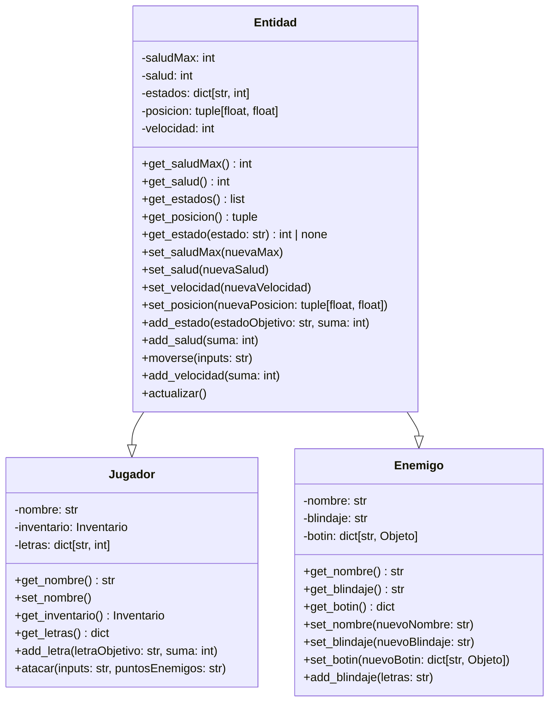

```mermaid
classDiagram
    class Entidad {
        -saludMax: int
        -salud: int
        -estados: dict[str, int]
        -posicion: tuple[float, float]
        -velocidad: int
        +get_saludMax() int
        +get_salud() int
        +get_estados() list
        +get_posicion() tuple
        +get_estado(estado: str) int | none
        +set_saludMax(nuevaMax)
        +set_salud(nuevaSalud)
        +set_velocidad(nuevaVelocidad)
        +set_posicion(nuevaPosicion: tuple[float, float])
        +add_estado(estadoObjetivo: str, suma: int)
        +add_salud(suma: int)
        +moverse(inputs: str)
        +add_velocidad(suma: int)
        +actualizar()
    }
    class Jugador {
        -nombre: str
        -inventario: Inventario
        -letras: dict[str, int]
        +get_nombre() str
        +set_nombre()
        +get_inventario() Inventario
        +get_letras() dict
        +add_letra(letraObjetivo: str, suma: int)
        +atacar(inputs: str, puntosEnemigos: str)
    }
    class Enemigo {
        -nombre: str
        -blindaje: str
        -botin: dict[str, Objeto]
        +get_nombre() str
        +get_blindaje() str
        +get_botin() dict
        +set_nombre(nuevoNombre: str)
        +set_blindaje(nuevoBlindaje: str)
        +set_botin(nuevoBotin: dict[str, Objeto])
        +add_blindaje(letras: str)
    }
    Entidad  --|>  Jugador
    Entidad  --|>  Enemigo
```