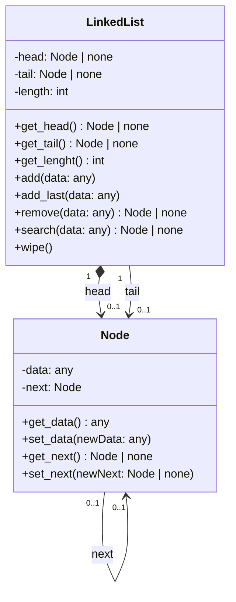

```mermaid
classDiagram 
    class Node {
        -data: any
        -next: Node
        +get_data() any
        +set_data(newData: any)
        +get_next() Node | none
        +set_next(newNext: Node | none)
    }

    class LinkedList {
        -head: Node | none
        -tail: Node | none
        -length: int
        +get_head() Node | none
        +get_tail() Node | none
        +get_lenght() int
        +add(data: any)
        +add_last(data: any)
        +remove(data: any) Node | none
        +search(data: any) Node | none
        +wipe()
    }
    LinkedList "1" *--> "0..1" Node: head
    LinkedList "1" --> "0..1" Node: tail
    Node "0..1" --> "0..1" Node: next
```